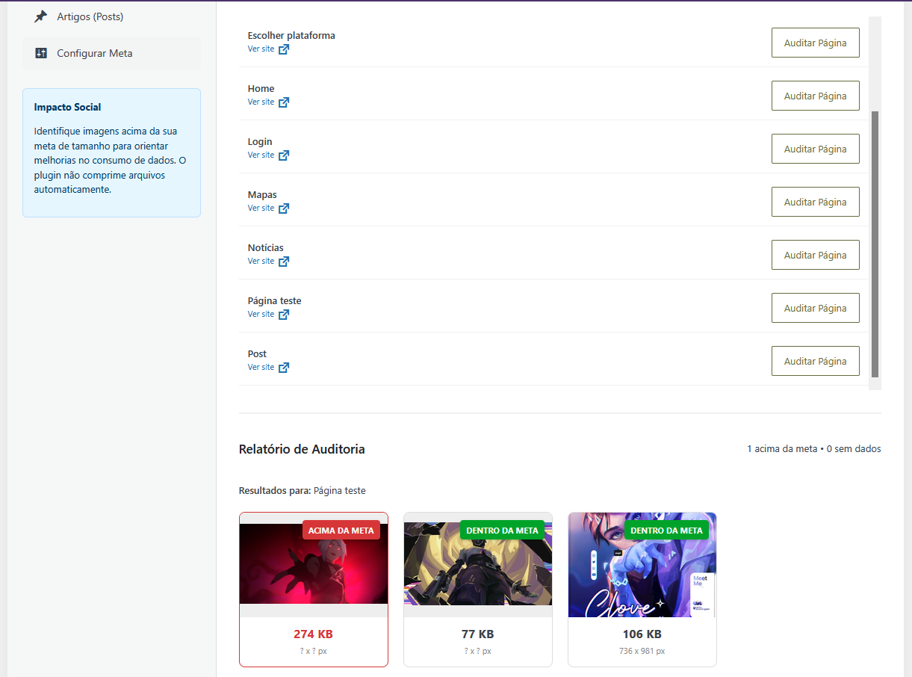
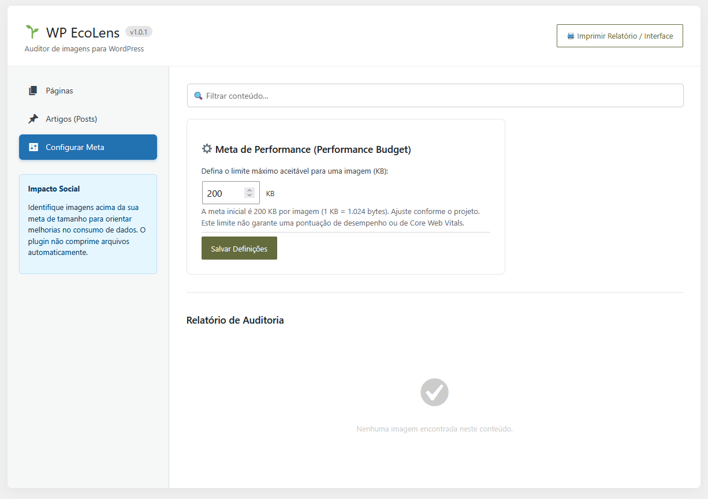
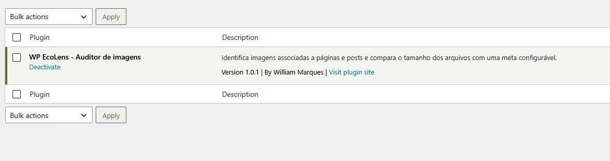

# WP EcoLens

**Auditoria de imagens e análise de páginas no painel do WordPress.**

O EcoLens ajuda a encontrar imagens pesadas e revisar o consumo de dados de um site. Nasceu como um snippet e evoluiu para um plugin instalável, com relatórios visuais e ferramentas para orientar melhorias.

**Versão 1.0.2** · [Código-fonte](wp-ecolens/wp-ecolens.php) · [Baixar pacote instalável](wp-ecolens.zip) · [Histórico](wp-ecolens/CHANGELOG.md)

## Demonstração

Teste da **versão 1.0.1** no projeto pessoal Valorant do autor. A página de teste reúne três imagens: uma acima da meta de 200 KB e duas dentro do limite. As capturas documentam essa versão; as funções novas da 1.0.2 estão descritas abaixo e ainda precisam de validação em WordPress.



<details>
<summary>Ver configuração e plugin ativo</summary>





</details>

O ambiente de demonstração é um projeto pessoal não oficial. As artes de terceiros exibidas nas capturas pertencem aos respectivos titulares e não fazem parte da licença do código.

## Funcionalidades

- Listas de páginas e posts publicados, com **20 itens por página** e navegação para os demais resultados.
- Busca no servidor por título ou conteúdo, além dos itens da página atual.
- Auditoria da imagem destacada, anexos de mídia e endereços em tags `` do conteúdo salvo.
- Meta configurável em KB; resultados **dentro da meta**, **acima da meta** e **sem dados**.
- Miniaturas, tamanho conhecido e dimensões disponíveis; soma dos arquivos encontrados separada do peso da página.
- Criação manual de **cópias WebP** de imagens JPEG e PNG estáticas da biblioteca.
- Análise opcional de desempenho, peso transferido e acessibilidade automática com Google PageSpeed Insights/Lighthouse.
- Consulta opcional de **LCP, INP e CLS de visitantes reais**, por URL e dispositivo, com a API CrUX.
- Estimativa de carbono a partir do peso informado pelo Lighthouse.
- Impressão do relatório e acesso restrito a administradores.

## Instalação e atualização

1. Abra [wp-ecolens.zip](wp-ecolens.zip) e baixe o arquivo pelo botão de download do GitHub.
2. No WordPress, acesse **Plugins → Adicionar plugin → Enviar plugin**.
3. Envie o ZIP, instale e ative. Se a versão anterior já estiver instalada, utilize a opção de substituir o plugin ao enviar o novo pacote.
4. Abra **EcoLens Audit** no menu administrativo.

O ZIP de **Code → Download ZIP** contém o repositório completo; use o arquivo instalável indicado acima. Na instalação manual, a pasta `wp-ecolens` deve ficar em `wp-content/plugins/`, com `wp-ecolens.php` diretamente dentro dela.

Desative o snippet antigo no WPCode/Code Snippets se ele ainda estiver ativo. Faça a atualização primeiro no ambiente de desenvolvimento. A opção `ecolens_limit` da versão anterior é preservada.

Requisitos declarados: WordPress 5.8 ou superior e PHP 7.4 ou superior. A geração WebP também exige suporte a esse formato no editor de imagens do servidor (GD ou Imagick). Esses requisitos não representam uma matriz de versões testadas.

## Como usar

Em **Páginas** ou **Artigos (Posts)**, busque o conteúdo e escolha **Auditar imagens**. Ajuste a meta em **Configurações** quando necessário. O valor inicial é 200 KB; 1 KB corresponde a 1.024 bytes.

Para comprimir uma imagem compatível, clique em **Criar cópia WebP** no cartão. O plugin usa qualidade 80, mantém as dimensões e registra uma nova imagem na biblioteca. O original e suas referências no site não são substituídos. Revise a cópia e selecione-a no editor da página, se desejar usá-la.

A conversão aceita arquivos locais de até 20 MB e 25 megapixels. GIF, SVG, WebP de entrada e PNG animado não são convertidos. Se a cópia não ficar menor, ela é descartada. Uma nova tentativa reutiliza a cópia existente quando o arquivo original continua igual.

Para analisar a página inteira, selecione **Celular** ou **Computador** e clique em **Analisar página (Google)**. A URL precisa estar pública e acessível ao Google; páginas locais, privadas ou protegidas por senha não servem para essa análise. As listas do plugin excluem conteúdos protegidos por senha.

## Integrações e privacidade

A análise externa só começa ao clicar no botão correspondente. A URL pública selecionada é enviada ao Google, que carrega a página para analisá-la. O plugin não envia cookies de autenticação do WordPress. Os relatórios retornados ficam em cache no banco: PageSpeed por 10 minutos e CrUX por uma hora.

O PageSpeed pode funcionar sem chave, mas está sujeito à disponibilidade e às cotas do serviço. Para uso regular, habilite a **PageSpeed Insights API** no Google Cloud. A consulta CrUX exige uma chave com a **Chrome UX Report API** habilitada.

Defina as chaves no `wp-config.php`, antes do comentário final que encerra as configurações:

```php
define('ECOLENS_GOOGLE_API_KEY', 'SUA_CHAVE_PAGESPEED');
define('ECOLENS_CRUX_API_KEY', 'SUA_CHAVE_CRUX');
```

As chaves ficam no servidor e não são inseridas no JavaScript. Não publique seu `wp-config.php` no repositório. Restrinja as chaves às APIs necessárias e acompanhe suas cotas no Google Cloud. A auditoria de imagens e a criação de cópias WebP não dependem dessas APIs.

## Como interpretar os resultados

**Imagens:** o tamanho corresponde ao arquivo local do anexo ou ao tamanho informado por uma resposta HTTP `HEAD`. Um tamanho indisponível aparece como **sem dados**. Dimensões desconhecidas são exibidas com `?`.

**Peso da página:** vem do indicador `total-byte-weight` do Lighthouse, referente ao carregamento observado no teste. Inclui os recursos medidos nesse carregamento, não apenas as imagens encontradas pelo plugin. Recursos carregados após interações podem ficar fora dessa medição.

**Desempenho e Core Web Vitals:** LCP, CLS e TBT do Lighthouse são resultados de laboratório. TBT não substitui INP. O bloco CrUX apresenta LCP, INP e CLS no percentil 75 de visitantes reais, para a URL e o dispositivo selecionados, com o período informado pelo serviço. Sem dados suficientes, não há classificação geral; isso não significa desempenho ruim. O plugin não substitui dados da página por dados de toda a origem.

**Acessibilidade:** a nota e a lista de falhas vêm das verificações automáticas do Lighthouse. Não certificam conformidade WCAG. Testes manuais com teclado, leitor de tela e revisão de conteúdo continuam necessários.

### Estimativa de carbono

Implementação do **Sustainable Web Design Model v4**, usando os coeficientes publicados na referência abaixo para um carregamento sem cache, sem desconto por hospedagem renovável. Não é uma medição das emissões reais nem uma média de todos os visitantes.

```text
GB = bytes observados pelo Lighthouse / 1.000.000.000
gCO₂e = GB × (0,055 + 0,059 + 0,080 + 0,012 + 0,013 + 0,081) × 494
```

As parcelas representam intensidades operacionais e incorporadas de centros de dados, redes e dispositivos. A intensidade elétrica é fixada em 494 gCO₂e/kWh. A estimativa não acompanha a rede elétrica em tempo real; sem peso disponível, não exibe emissão numérica.

Referências técnicas: [PageSpeed Insights](https://developers.google.com/speed/docs/insights/v5/get-started), [API PageSpeed](https://developers.google.com/speed/docs/insights/v5/reference/pagespeedapi/runpagespeed), [CrUX](https://developer.chrome.com/docs/crux/api), [métricas e limiares CrUX](https://developer.chrome.com/docs/crux/guides/crux-api), [modelo SWDM v4](https://sustainablewebdesign.org/estimating-digital-emissions/).

## Limitações e validação

A auditoria local de imagens não percorre dados internos do Elementor, fundos em CSS, `srcset` ou conteúdo dinâmico. Anexos podem aparecer mesmo sem uso na página, e o arquivo original pode diferir da versão entregue ao visitante. Consultas a muitas imagens externas podem atingir o tempo limite do servidor.

A versão 1.0.1 foi instalada e utilizada pelo autor, com relatos e capturas de auditorias e conteúdo sem imagens. A **1.0.2 contém funções novas ainda não validadas em uma instalação WordPress**. Confira o registro e o roteiro em [TESTES.md](wp-ecolens/TESTES.md).

Se uma conversão for interrompida por erro fatal do servidor, pode permanecer um bloqueio para aquele anexo. Depois de confirmar que não há conversão em andamento, um administrador com WP-CLI pode remover a opção `ecolens_compress_lock_ID`, substituindo `ID` pelo número do anexo. A exclusão do plugin não remove as cópias WebP criadas na biblioteca.

## Autor e desenvolvimento

Projeto pessoal de [William Marques](https://github.com/william270419), desenvolvido com apoio do ChatGPT na criação e revisão do código. O autor realizou a instalação e a verificação manual inicial da versão 1.0.1.

Tecnologias: PHP, WordPress Plugin API, WordPress Image Editor, HTTP API, JavaScript, jQuery, AJAX, HTML e CSS. O plugin não usa IA durante seu funcionamento.

Código distribuído sob [GPLv2](wp-ecolens/LICENSE).

## Novidades da versão 1.0.2

- Paginação e busca em todos os conteúdos publicados elegíveis.
- Correção do relatório mantido ao trocar de aba, incluindo respostas atrasadas de consultas anteriores.
- Mensagens distintas para lista sem posts e conteúdo sem imagens.
- Criação de cópia WebP, preservação do original e descarte de cópias sem redução de tamanho.
- Integração PageSpeed/Lighthouse para peso transferido, desempenho e acessibilidade automática.
- Integração CrUX para Core Web Vitals de visitantes reais, quando disponíveis.
- Estimativa de carbono SWDM v4 com fórmula e hipóteses documentadas.
- Layout de impressão ajustado para evitar cartões divididos e ocultar os controles.
- Separação do código em arquivos PHP, JavaScript e CSS carregados apenas no painel do plugin.
